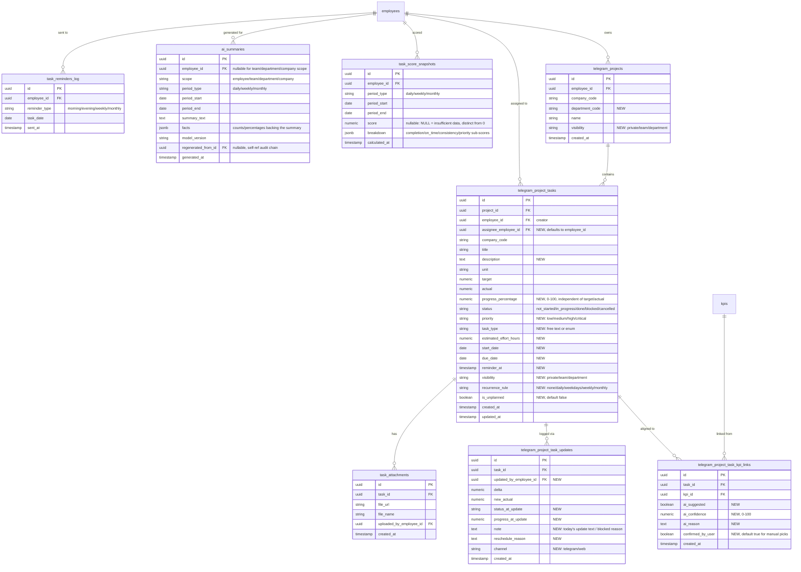

# Performix — Task Management Module Design

Status: **design draft, not yet built**. This covers the "before coding" deliverables (ERD, permission matrix, user flows, screen inventory, API contracts, risks) for the Task Management System spec, scoped to this codebase's existing architecture per the decisions below.

## 0. Grounding decisions

These were confirmed before drafting anything below — they change the shape of everything that follows, so they're recorded here rather than assumed.

1. **Reuse the existing role hierarchy**, not a new `role_id`/`division_id` model. This app has exactly four role values: `EXECUTIVE → MANAGER → VP → SLT` (all-caps, compared via `strtoupper(trim($role))`). There is **no `division` concept** anywhere in the schema. There is **no separate System Admin role** — the one "admin" surface (SLT-only "view as" impersonation in `AdminController`) is gated by `department_code === 'BTS'`, not by role. See §2 for the mapping from the spec's six named roles onto this reality.
2. **Task is a new, separate entity from KPI.** Task progress never writes to `kpi_quarters.quarter_actual`. A task may optionally link to a KPI (`kpi_id`) purely for alignment/reporting; the link carries no write access to the KPI's numbers. This matches the existing `telegram_project_task_kpi_links` design, which already enforces this separation (`TelegramProjectTaskController::updateProgress()` — explicitly does not touch KPI actuals).
3. **Extend existing infrastructure, don't rebuild it.** There is already a live, working task/project system:
   - `telegram_projects`, `telegram_project_tasks`, `telegram_project_task_kpi_links`, `telegram_project_task_updates` — powering both the Telegram bot ("Things To Do" screen, `TelegramProjectTaskController`) and the web Mini App (`MiniAppTaskController`).
   - This is the real foundation for "Performix." The plan below is written as **ALTERs and additions** to these tables, not a parallel schema.
   - There is also a **dead, unwired `TaskController` + bare `tasks` table** — no routes reference it, its view doesn't exist, and its `destroy()` method actually deletes KPI rows (mislabeled leftover). **Leave this untouched.** Do not repurpose the `tasks` table; it's documented in `database/telegram_projects.sql` as deliberately separate/unused.
4. **Hierarchy visibility reuses `ApprovalHierarchyService`'s chain fields** (`manager_id`, `vp_id`, `reports_to_id` — the `_id` variants, not the `_code` variants used elsewhere), not new fields. "Direct reports" queries are done ad hoc via equality filters on these, same pattern as `LinkageController`/`AuthController` already use.

---

## 1. Entity relationship model

New/altered tables only — everything else (`employees`, `users`, `user_company_roles`, `kpis`, `kpi_quarters`, `public_holidays`) is existing and unchanged.



`task_reminders_log` carries a unique constraint on `(employee_id, reminder_type, task_date)` — this is what makes the scheduler idempotent (§6 risk R3).

---

## 2. Role → permission matrix

The spec's six roles collapse onto the app's four real role values plus one existing structural flag. "Team Lead" isn't a distinct role in this system — it's a `MANAGER` whose direct reports are computed the same way regardless, so it's a *view*, not a role.

| Spec role | Maps to | Scoping field |
|---|---|---|
| Employee | `EXECUTIVE` | own `employee_id` only |
| Team Lead | `MANAGER` (with direct reports, `has_subordinates`) | self + employees where `reports_to_id`/`manager_id` = this employee |
| Manager | `MANAGER` | self + all employees in `department_code` |
| VP / Head | `VP` | self + all employees/departments in `company_code` under this VP's `reports_to_id` chain |
| Founder / Boss / SLT | `SLT` | entire `company_code` (all departments) |
| System Admin | `department_code === 'BTS'` (existing convention, not a role) | full system config |

| Action | EXECUTIVE | MANAGER | VP | SLT | BTS admin |
|---|---|---|---|---|---|
| Create own task | ✅ | ✅ | ✅ | ✅ | ✅ |
| Edit/delete own task | ✅ | ✅ | ✅ | ✅ | ✅ |
| Assign task to someone else | ❌ | ✅ (dept reports) | ✅ (division reports) | ✅ (anyone) | ✅ |
| View own tasks/scores/summaries | ✅ | ✅ | ✅ | ✅ | ✅ |
| View direct reports' tasks/scores | ❌ | ✅ | ✅ | ✅ | ✅ |
| View department-wide tasks/scores | ❌ | ✅ (own dept) | ✅ | ✅ | ✅ |
| View company-wide dashboard | ❌ | ❌ | ❌ (own scope only) | ✅ | ✅ |
| Confirm/override AI KPI suggestion | ✅ (own task) | ✅ (own + assigned) | ✅ | ✅ | ✅ |
| Regenerate AI summary | ✅ (own) | ✅ (own + team) | ✅ | ✅ | ✅ |
| System config / scheduler settings | ❌ | ❌ | ❌ | ❌ | ✅ |

Enforcement point: a single `TaskAccessPolicy`-style helper (mirroring how `KpiController`/`DashboardController` already branch on `strtoupper($role)`) — **not** row-level Postgres policies, since this app queries Supabase via REST with the service-role key and does all authorization in PHP (consistent with the rest of the codebase; introducing RLS here would be the one architectural inconsistency, so explicitly skipped — see R6).

---

## 3. User flows

**3.1 Telegram connect (existing, unchanged)** — `TelegramLinkController` already does steps 1-4 of the spec's "Telegram Connection" section (verify account, match `telegram_user_id` → `employee_id` via `users`/`user_company_roles`, load role+hierarchy). Deep links and the hamburger quick-access menu are additive UI work on top of this, not a new backend flow.

**3.2 Morning reminder (8:30 AM MYT)**
1. Scheduler queries employees with `is_active` in the current company, timezone-aware.
2. Skip if a `task_reminders_log` row already exists for `(employee_id, 'morning', today)`.
3. Skip if the employee already has ≥1 task with `start_date = today` created/confirmed today.
4. Send Telegram message with "Open Daily Tasks" deep link → `/telegram/app?screen=create-task`.
5. Insert the `task_reminders_log` row (idempotency).

**3.3 Evening update (5:30 PM MYT)**
1. Query today's open tasks (`status not in (done, cancelled)`, `due_date <= today` or `start_date = today`) per employee.
2. Skip sending if zero open tasks need an update.
3. Present each task for status update (`not_started/in_progress/done/blocked/cancelled`) + progress 0–100.
4. If `blocked` → require `note` (maps to existing `telegram_project_task_updates.note`, new column).
5. Allow "+ unplanned task" inline (creates a task with `is_unplanned = true`, `start_date = today`).
6. Allow reschedule → writes `reschedule_reason`, moves `due_date`.
7. On submit: insert one `telegram_project_task_updates` row per changed task, recompute that day's `task_score_snapshots` (daily), generate/refresh the daily `ai_summaries` row, reply with On Track/At Risk/Critical.

**3.4 Weekly summary (Friday 5:30 PM MYT)** — aggregates the week's `telegram_project_task_updates` grouped by `project_id`/KPI link, computes weekly `task_score_snapshots`, generates `ai_summaries` (scope=employee), and — only if the employee has direct reports — a second `ai_summaries` row (scope=team) with an attention list built from direct reports' weekly scores. Hierarchy filtering here reuses §0.4 (no new employees outside `reports_to_id` chain are ever loaded into the prompt/context passed to `AiService`).

**3.5 Monthly summary (last business weekday, 5:30 PM MYT)** — "business weekday" reuses the existing `public_holidays` table (already in the schema) for the Malaysia calendar; same aggregation as weekly but month-over-month comparison, plus a `scope=department` summary for managers and `scope=company` for SLT.

**3.6 AI KPI-alignment suggestion** — on task create, `AiService` (already the home of all OpenAI calls) gets a new method `suggestTaskKpiLink(taskTitle, description, employeeKpis)` returning `{kpi_id, confidence, reason}` or `null`. Written into `telegram_project_task_kpi_links` only after the user confirms (`confirmed_by_user = true`); "Not linked to KPI" simply skips the insert.

---

## 4. Screen inventory

**Telegram Mini App** (extends `resources/views/telegram/app.blade.php` + `resources/views/mini-app/index.blade.php`, both already card-list based — no Kanban board exists or is planned, per spec's "one-thumb friendly" requirement):

| Screen | New or existing | Notes |
|---|---|---|
| Home | existing (`renderMyKpis`/dashboard tab) | add Daily Progress ring, Task Score, AI Daily Insight card |
| Create Task | extend existing "new task" flow | add description, dates, priority, type, effort, attachment, recurrence, visibility |
| My Tasks | existing (TTD list) | add filters: status, priority, project |
| Daily Update | new | the 5:30 PM flow as an in-app screen, not just a Telegram message |
| Task Details | new | single-task drill-down: history (`telegram_project_task_updates`), KPI link, attachment |
| Calendar | new | month view of `start_date`/`due_date` |
| KPI Alignment | existing (`kpiOptions`/`linkKpis`) | add AI suggestion + confidence UI |
| Daily Summary | new | today's AI summary card |
| Weekly Summary | new | reuses the existing `telegram_ai_reviews`-style pattern already built for KPI reviews |
| Monthly Summary | new | same pattern, monthly scope |
| My Team | new | managers/VPs/SLT only, per §2 matrix |
| Notifications | new | reads `notifications` table (already exists) |
| Profile | existing | no change needed |

**Web dashboard** (extends `resources/views/dashboard/*`, `DashboardController`):

- Employee dashboard: today's tasks, due today, overdue, daily progress, Task Score, KPI alignment, AI daily insight, quick-create — same widget set as the Mini App Home, desktop layout.
- Manager dashboard: team completion rate, team Task Score, attention list, overdue/blocked, by-project, by-KPI, trends, AI management summary.
- Founder/SLT dashboard: company-wide, filterable (company/department/manager/project/KPI/period), On Track/At Risk/Critical %, department comparison, KPI alignment overview, drill-down, executive AI summary.

All three are additive widgets on top of the existing dashboard pages, not new pages — this app's existing `DashboardController` already computes weighted KPI scores and department rankings; Task widgets sit alongside them.

---

## 5. API contracts (additions)

Existing endpoints (`/api/telegram/projects*`, `/api/telegram/project-tasks*`, `/mini-app/api/tasks*`) are extended in place — same routes, richer payloads. New endpoints only:

```
POST   /api/telegram/project-tasks/{id}/daily-update
  body: { status, progress, note?, reschedule_to?, reschedule_reason? }
  -> { success, task, score_delta }

POST   /api/telegram/project-tasks/{id}/kpi-suggestion
  -> { kpi_id, confidence, reason }   // AI suggestion, not yet written

GET    /mini-app/api/tasks/score?period=daily|weekly|monthly
  -> { period_start, period_end, score, breakdown, status: on_track|at_risk|critical }

GET    /mini-app/api/summaries?scope=employee|team|department|company&period=daily|weekly|monthly
  -> { summary_text, facts, generated_at, model_version }

POST   /mini-app/api/summaries/regenerate
  body: { scope, period, period_start }
  -> { summary, regenerated_from_id }   // audit-chained, per §0 rule

GET    /mini-app/api/team/attention   // managers/VP/SLT only, 403 otherwise
  -> { at_risk: [...], overdue: [...], critical: [...] }
```

All endpoints reuse the existing `kpi.auth` session middleware (web) / `TelegramWebAppAuth` (Telegram) — no new auth mechanism.

---

## 6. Security & scalability risks

- **R1 — Authorization is manual PHP, not DB-level.** Every new endpoint must explicitly re-derive the caller's allowed employee_id set (per §2) before querying — a missed check leaks cross-department task data. Mitigate by writing one shared `TaskAccessPolicy::visibleEmployeeIds($actor)` helper and requiring every new controller method to call it, rather than each one hand-rolling the role branch.
- **R2 — AI summaries must not leak data across the hierarchy.** `AiService` prompts for team/department/company summaries must only be built from data already filtered by `TaskAccessPolicy`; never pass a raw "all employees" query into the prompt context.
- **R3 — Reminder duplication under scheduler retries.** The unique constraint on `task_reminders_log(employee_id, reminder_type, task_date)` is the idempotency guard; the insert must happen in the same request/job that sends the Telegram message (insert-then-send, or catch the unique-violation and skip send) so a retried cron invocation can't double-send.
- **R4 — Task Score gaming.** Per the spec's own rules (no reward for volume, cancelled tasks score zero, overdue high-priority penalised harder) — implement scoring as a pure function over `task_score_snapshots.breakdown` with unit tests per rule, since this is the piece most likely to be quietly broken by a future "just add one more task type" change.
- **R5 — Scale to 1,000 DAU on Supabase REST.** No connection pooling control from PHP's side (`Http::` client per request) — dashboard aggregates (Task Score, team attention) must be **precomputed** into `task_score_snapshots`/`ai_summaries` by scheduled jobs, not calculated live on every dashboard load, or 1,000 concurrent users will each trigger N Supabase REST calls per page. This mirrors the existing `getMany()`/`Http::pool()` pattern already used for concurrent fetches — extend it, don't fetch sequentially.
- **R6 — No Postgres RLS.** Explicitly a known, accepted gap (see §2) — the service-role key bypasses RLS by design in this app's existing architecture, so authorization is 100% a PHP-layer responsibility. Flagging here so it isn't "discovered" later as a surprise; it's a standing property of this codebase, not something new introduced by this module.
- **R7 — Legacy `tasks` table / `TaskController` confusion.** Because a same-named-in-spirit but unrelated `tasks` table and unwired `TaskController` already exist, any future search-and-reuse pass on this codebase risks accidentally wiring the dead controller back up or writing to the wrong table. Recommend a one-line comment at the top of the legacy `TaskController.php` and `tasks` table flagging it as unused/do-not-wire, once this module ships.

---

## 7. Suggested build order (module by module)

1. Schema: ALTER `telegram_project_tasks`/`telegram_project_task_kpi_links`/`telegram_project_task_updates` per §1; create `task_attachments`, `task_score_snapshots`, `ai_summaries`, `task_reminders_log`.
2. `TaskAccessPolicy` helper (§2/§6-R1) — build once, reuse everywhere below.
3. Task CRUD extensions (`MiniAppTaskController`, `TelegramProjectTaskController`) — new fields, daily-update endpoint.
4. Task Score calculation service + unit tests (§6-R4) — pure function first, wire into scheduler after.
5. Reminder scheduler (morning/evening) with idempotency log (§6-R3).
6. AI: `AiService::suggestTaskKpiLink()` + daily/weekly/monthly summary generation, audit-chained regeneration.
7. Mini App screens (§4) — Daily Update, Task Details, Calendar, Summaries, My Team.
8. Web dashboard widgets (§4) — employee/manager/founder, reusing existing `DashboardController` patterns.
9. Weekly/monthly cron wiring (reuse existing Telegram digest console-command pattern).
10. Tests: access-control tests per §2 matrix, scoring unit tests, integration test for the idempotent-reminder path.

Each module ships independently and is verified against real Supabase data before moving to the next, consistent with how the rest of this codebase has been built.
